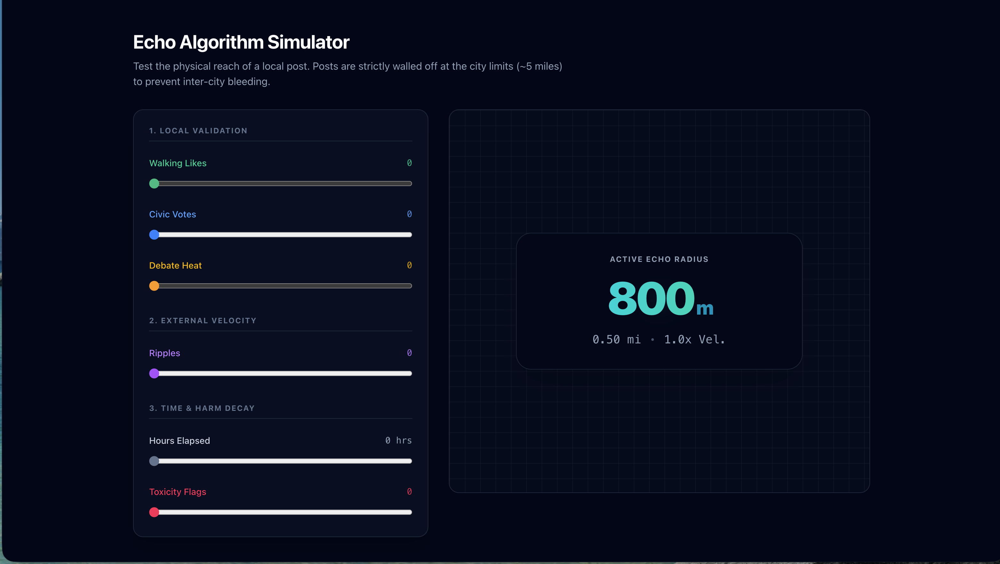

# Wilmington Community Sounding Board

A premium, hyper-local community bulletin board and planning district feedback platform for Wilmington, Delaware. This Progressive Web App (PWA) enables local citizens and businesses to coordinate planning actions, raise civic alerts, and build consensus on neighborhood-level proposals.

---

## 🚀 Recent Architectural Updates

We have recently completed an overhaul of our core layout, routing, and interactivity frameworks to optimize the PWA's mobile usability and anonymous whistleblowing pipeline:

- **Responsive Layout Fixes:** Overhauled the mobile flexbox architecture to ensure boundary feeds (Neighborhood, District, City) scale perfectly without crushing post cards, and implemented strict `object-contain` aspect ratios for user media.
- **Bi-Directional Map & Drawer Sync:** Engineered a seamless Bottom Sheet UI using `pointer-events` toggling and `overscroll-contain`, allowing independent, fluid scrolling between the Leaflet map layer and the Post feed.
- **Custom Community Reactions & Civic Voting:** Replaced generic likes with a hyper-local interaction suite (`Love Local`, `Second This`, `Not For Me`, `Bad for Community`) and restored dynamic polling for Civic Proposals.
- **"Citizen" Anonymity Pipeline:** Shipped an opt-in privacy feature that masks users as `citizen+[id]` during post creation to encourage safe, local whistleblowing and honest civic feedback.

---

## 📡 The Dynamic Echo Algorithm
Rather than relying on flat, chronological feed algorithms that get clogged with noise, our post reach is governed by a proprietary **Calculate-on-Write Proximity Algorithm**. 

Reach expands dynamically through community validation and external shares ("Ripples"), but decays naturally over time or when flagged by the community for toxicity. To prevent inter-city bleeding, post reach is strictly walled-off at the city limits.

<a href="https://soundingboard-pwa.vercel.app/simulator" target="_blank">
  
</a>

*👆 Click to try the live interactive algorithm simulator.*

---
## 🛡️ Privacy First: Strict Location & Data Policy

Our platform is engineered with structural privacy constraints to ensure local feedback remains authentic without exposing user safety:

- **Zero Data Harvesting:** We do not track, harvest, package, or sell user data to third-party brokers, data aggregators, or advertising networks.
- **What We Collect:** The only data captured is the information explicitly provided in a user's profile and their device's current location coordinates upon application load.
- **How Location is Used:** Location data is strictly ephemeral. It is used exclusively by our PostGIS database (`ST_DWithin`) to calculate physical proximity to local posts and define the active boundaries of the Echo algorithm. We do not maintain a historical ledger of user movements.

---

## 💎 Future Roadmap: User-Centric Monetization

Our revenue model will never rely on programmatic ads or user data selling. We are planning a sustainable, utility-based monetization structure:

- **Business "Beacons":** Local verified businesses (like a coffee shop or food truck) can pay a micro-transaction to broadcast a highly visible, geo-fenced post with a guaranteed initial radius, cleanly marked as a sponsor.
- **Municipal Dashboards:** Offering premium, paid analytics tools for City Councils or neighborhood associations to view anonymized, aggregate sentiment data on Civic Proposals (e.g., "70% of District 4 agrees with this proposal"), providing value to local government without compromising individual voter identity.
- **Community Supporter Tiers & Theming:** Optional, low-cost premium profiles that give users supporter badges or custom UI theme toggles (including a future-planned Light/Dark mode with FOUC prevention) to help fund server costs.
- **Storefront GIS Overlays:** Planned premium integration to project local verified business storefronts onto the Leaflet map as glowing, interactive location markers.

---

## Key Features

### 1. Interactive GIS Map Boundaries
- **Spatial Vectors**: Renders vector planning district grids and neighborhood boundaries for Wilmington, Delaware (including Forty Acres, Highlands, Rockford Park, Center City, etc.).
- **Geographic Filtering**: Clicking any map cell/boundary instantly scopes the bulletin feed and map zoom to focus on that specific neighborhood or district.

### 2. Civic Consensus Voting & Witty Reactions
- **Civic Proposals**: Users can flag posts as civic proposals to gauge community opinion. 
- **Consensus Gauge**: Proposals display an interactive gauge splitting community opinions (Second vs. Object) with a visual colored split bar.
- **Witty Standard Reactions**: Regular posts support quick local sentiments:
  - **❤️ Love Local**: *"Gives Wilmington warm fuzzies"*
  - **🤝 Second This**: *"We need this in our lives"*
  - **👎 No Thanks**: *"Not in my backyard!"*
- **User-Scoped Reaction Integrity**: Enforces that each user has at most one active reaction per post. Clicking a different reaction swaps their vote, and re-clicking their current reaction undoes/untoggles it.

### 3. PWA & Robust Offline Auto-Sync
- **Offline Draft Queue**: When network connectivity is lost (detected using periodic network fetch checks), the post creator swaps to **"Queue Offline Draft"**, saving payloads in `localStorage`.
- **Automatic Reconnection Sync**: When connection is restored, the application background-syncs queued posts, clears local storage, and refreshes the feed seamlessly.
- **Manual Installation Prompts**: Provides stand-alone custom PWA install triggers on mobile/desktop, with manual installation cards for Safari on iOS.

### 4. Premium Responsive Design
- **Palette**: Tailored using a charcoal/cream/brick red palette:
  - **Slate Charcoal (`#2B2D42`)** — Primary text, cards, and navigation bars.
  - **Warm Alabaster (`#FDFBF7`)** — Eye-strain-reducing background.
  - **Row-House Brick Red (`#D90429`)** — Civic-minded brand accent.
- **Glassmorphic HUD Banners**: Uses custom CSS variables mapped to Tailwind v4 `@theme` properties for a premium glassmorphic feel.

### 5. Multi-User Sandbox Contexts
- **Profile Context Switcher**: A quick account switcher lets you simulate interactions under different local personas:
  - **Marcus Williams** (Citizen - Forty Acres)
  - **Sarah Thompson** (Citizen - Center City)
  - **Brew Haha Cafe** (Business - Delaware Ave)
  - **Constitution Yards** (Business - Riverfront)
- **Business Location Lock**: Business accounts are locked to post from their registered coordinates, ensuring foot traffic authenticity.

---

## Technical Stack & Architecture

- **Framework**: Next.js (App Router, Server Actions, Turbopack dev pipeline)
- **Styling**: Tailwind CSS v4 & Vanilla CSS custom variables
- **Database (Dual Mode)**:
  - **PostgreSQL Mode**: Uses `Drizzle ORM` to execute schema validation, unique indexes, and relational joins on tables (`users`, `posts`, `post_reactions`, `neighborhoods`, `planning_districts`).
  - **Mock Fallback Mode**: If PostgreSQL is unreachable, the system fails-fast into a local JSON database pipeline (`src/db/mock_db.json`) executing the exact same relational checks, counters, and updates.
- **Service Worker**: `/public/sw.js` intercepting assets using a **Network-First** strategy for root pages and API paths (ensuring dynamic feeds stay fresh) while bypassing localhost during development to preserve Fast Refresh speed.

---

## Getting Started

### Prerequisites
- Node.js (v18+)
- npm

### Installation
1. Clone the repository
2. Install dependencies:
   ```bash
   npm install
   ```

### Running Locally
Run the Next.js development server:
```bash
npm run dev
```
Open [http://localhost:3000](http://localhost:3000) with your browser.

### Building for Production
To build the application bundle and test static page compilation:
```bash
npm run build
```
To run the production build:
```bash
npm run start
```
